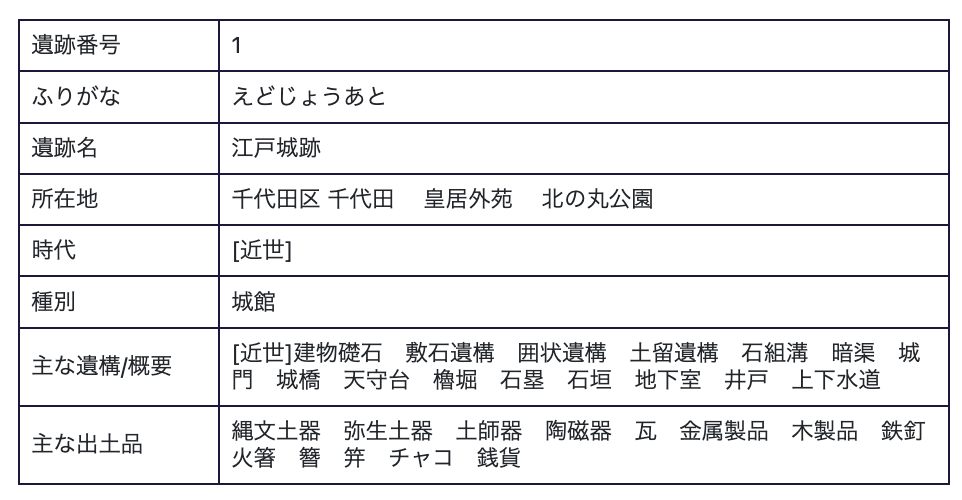

# geo-spatial data of registered archaeological sites in Tokyo Metropolitan Area／東京都遺跡地図空間データ
This is digitized geo-spatial data of archaeological sites in Tokyo, based on [Tokyo Metropolitan government Internet map of archaeological sites (Japanese Only)](https://tokyo-iseki.metro.tokyo.lg.jp/)(hereafter 'TokyoMETmap'), publsihed by Tokyo Metropolitan Board of Education.  
これは東京都教育委員会による[東京都遺跡地図情報インターネット提供サービス](https://tokyo-iseki.metro.tokyo.lg.jp/)（以下「東京都遺跡地図」）にもとづき、東京都の遺跡（埋蔵文化財包蔵地）情報を代表点の位置座標を付加して再利用可能な空間データ化したものです。  

## Usage／ご利用にあたって

1. Basic data (**all descriptive contents are only in Japanese. English compiled version will be published in later**)  
* formatted in .csv (encoding = UTF-8, without BOM)  
* provided as following 3 files:  
* 13Tokyo.csv: composed of 11 fields
    * JASID (*original*): Japanese Archaeological Site ID, 11 digit integer, UID in combination with LGC (5 digit) + site ID (3 digit, by municipality) + sub-ID (2 digit, NA=00);  
    * LGC (*original*): [Local Government Code](http://data.e-stat.go.jp/lodw/en/provdata/lodRegion), 5 digit integer (first 2 digit indicates prefecture);  
    * SiteID (*TokyoMETmap*): 1 to 4 digit integer, sometime added sub-ID registered by municipality;  
    * Furigana (*TokyoMETmap*): *Japanese Only* Japanese Pronounciation of site name
    * Site name (*TokyoMETmap*): *Japanese Only*
    * Address (*TokyoMETmap*): *Japanese Only* Postal Address
    * Age and period (*TokyoMETmap*): Palaeolithic, Jomon, Yayoi, Kofun, Nara, Heian, Medieval, Early modern, Modern and unknown (subdivision of each age is optional)  
    * Site type (*TokyoMETmap*): settlement, shell midden, tumulus, castle and fort, etc.;  
    * Main archaeological features (*TokyoMETmap*): documented features such as dwelling pits, grave, and other structures by excavation;  
    * Main archaeological objects (*TokyoMETmap*): documented object such as Jomon pottery, stone tools, metal object, etc.;  
    * Coordinates (*original*): a combination of longitude and latitude of single representative point of the site, not in shape (as TokyoMETmap represents).  
    * **notification**: coordinates in this dataset are manually acquired from the original TokyoMETmap. Thus information is not originated from TokyoMETmap, and the author of this dataset doesn't give any guarantee of accuracy of those coordinates (disclaimer)  
* 13TokyoAge.csv: JASID + LGC + Furigana + Site name + 0-1 vectorized age/ period (P: Palaeolithic, J: Jomon, Y: Yayoi, K: Kofun, N, Nara, H: Heian, M: Medieval, E: Early modern, D: Modern, U: unknown) 
* 13Tokyo_total.csv: including unvalidated information as same as the original *TokyoMETmap* DB

1. 基本データ  
* 基本データは.csv形式(UTF-8, BOMなし)，以下の3ファイル  
* 13Tokyo.csv: JASID+自治体コード+東京都遺跡地図収録8項目+位置座標(経度・緯度)  
    * 内容：JASID+自治体コード+東京都遺跡地図収録8項目（遺跡番号、ふりがな、遺跡名、所在地、時代、種別、主な遺構／概要、主な出土品）+位置座標   

    * JASID(Japan Archaeological Site ID: 11ケタ)＝自治体コード(5ケタ)+遺跡番号(自治体ごと:4ケタ)+枝番号(2ケタ、枝番ナシは00)  
    * 位置座標は、東京都遺跡地図を参照、目視により確認した代表点を取得した単点座標であり、ポリゴンやそれに基づく点座標ではない  
    * したがって**位置座標は東京都遺跡地図が提供するものではなく本データセット固有の情報である**  
    * **本データセットの提供者は位置座標の正確性を保証しない**  
* 13TokyoAge.csv: 東京都遺跡地図【時代】列の入力項目を01ベクトルに変換したもの、JASID +自治体コード+遺跡番号+ふりがな+遺跡名+位置座標+時代別01ベクトル（P: 旧石器、J: 縄文、Y: 弥生、K: 古墳、N: 奈良、H: 平安、M: 中世（鎌倉〜安土桃山）、E: 近世（江戸）、D: 近代（明治以降）、U: 時代不明）  
* 「[全国遺跡報告総覧](https://sitereports.nabunken.go.jp/ja)」の書誌情報・抄録情報との紐づけは将来的に実装する予定(したい) 
* 13Tokyo_total.csv: 抹消データ、位置情報不明（東京都遺跡地図で確認不能）データを含むオリジナルデータ
* **アーカイブデータ**
* 13Tokyo_total2020.csv: 2020年作業時のオリジナルデータ 

2. 自治体別データ(byMunicipalityサブディレクトリ)  *準備中*  
    * 13Tokyo.csvを自治体ごとに分割したもの  
    * ファイル命名規則：ファイル名の上5ケタは[自治体コード](https://www.soumu.go.jp/denshijiti/code.html)+自治体名ローマ字表記  

3. 時代別データ(byAgeサブディレクトリ)  
    * 各時代別の一覧リスト  
    * "13Tokyo.csv"の【時代】列の入力項目により時代別に分割したもの(時代別リスト間で重複あり)  
    * ファイル命名規則："13Tokyo_total_"に各時代名を付す(palaeolithic, jomon, yayoi, kofun, nara, heian, medieval, earlymodern, unknown  

4. SJSデータ（SJSサブディレクトリ）
    * 各時代別の一覧リスト（3.時代別データと同等）をShiftJIS（CP932）で保存したもの

## Contributing／コントリビューション
Pull requests are welcome. For major changes, please open an issue first to discuss what you would like to change.  
プルリクエスト歓迎。大規模な変更はイシューからどうぞ。  

## Author／作成者
Atsushi Noguchi ([kotodijian](https://github.com/kotdijian) or [@fujimicho](https://X.com/fujimicho)  

## Contributors／協力者  
* [@ta-niiyan](https://twitter.com/ta_niiyan): 13109_Shinagawa-ku／品川区, 13111_Ota-ku／大田区のリスト、および東京都遺跡地図データ取得協力  
* 東京学芸大学2020年度春学期開講「[地域考古学B](https://portal.u-gakugei.ac.jp/syllabus/)」(教育支援課程教育支援専攻文化遺産教育サブコース60737000)受講生 (students of "Regional Archaeological Studies B" class in Tokyo Gakugei Univesity, 2020 Spring semester): 13203_Musashino-shi／武蔵野市，13204_Mitaka-shi／三鷹市，13205_Ome-shi／青梅市，13026_Fuchu-shi／府中市，13208_Chofu-shi／調布市，13209_Machida-shi／町田市，13210_Koganei-shi／小金井市，13211_Kodaira-shi／小平市，13214_Kokubunji-shi／国分寺市，13215_Kunitachi-shi／国立市
  
